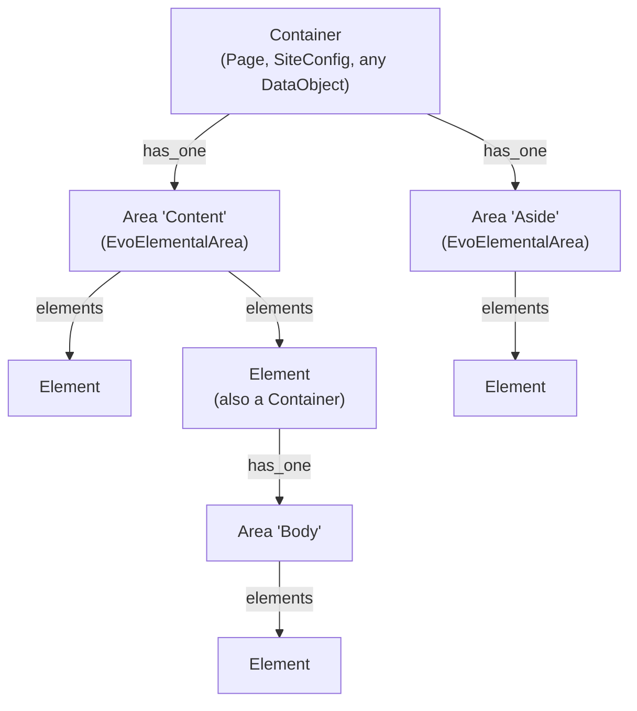

# Concepts

elemental-base reshapes vendor elemental around a small set of ideas. Once these
click, the rest of the module is predictable. This guide is the mental model; the
later guides are the detail.

## The three roles

Everything in elemental-base is one of three things — and, importantly, a single
class can play more than one role.

**Container** — a DataObject that owns one or more areas. It declares them in
`$elemental_areas`. `Page` and `SiteConfig` are containers out of the box; you can
make any DataObject a container by applying the `ElementalAreasContainer` extension.

**Area** — an `EvoElementalArea` (or subclass): an ordered list of elements,
identified by a *name* within its container. An area decides which element classes it
will accept, and whether anchors and on-page navigation apply to it.

**Element** — a block. In practice a subclass of `EvoBaseElement`. An element can
*also* be a container (it can own its own areas), which is how nesting works.



A container has named areas; each area has elements; an element may itself be a
container with its own areas. The structure is recursive, and the same `EvoElementalArea`
and `EvoBaseElement` classes are used at every level.

## Local vs current

This is the single most important distinction in the module.

- A **local** area is the one stored in a container's own relation — its own data.
- A **current** area is the one actually *used* when a particular container instance
  renders. It is usually the local area, but it may be inherited from a parent or
  shared from elsewhere.

The same split applies to an area's **name** and **container**: an area resolves its
current name/container first, then falls back to its local (stored) name/container.

```php
$area->getLocalContainer();   // where this area is stored
$area->getCurrentContainer(); // who is using it right now (may be inherited)
$area->getContainer();        // current ?? local
```

Why it matters: an editor's *draft* always edits the local area (its real, stored
data), while the front end renders the current area (which may have been inherited or
shared in). [Inheritance & sharing](05_inheritance-and-sharing.md) is built entirely
on this distinction. If you never use inheritance, current and local are always the
same and you can ignore the difference.

## Providers and shared elements

An element can return a list of elements to render **in its place**, via
`provideElements()`. When an area builds its element list, any element that provides
others is swapped out for what it provides. Each provided element keeps a reference
back to the element that provided it (its **provider**), so context-sensitive
behaviour — anchors, menu visibility — resolves against the provider rather than the
shared element's own (out-of-context) configuration.

This is elemental-base's answer to `ElementVirtual`: instead of mirroring one block by
ID, you build an element that *sources* a set of blocks (for example, from a shared
area on `SiteConfig`). See [Inheritance & sharing](05_inheritance-and-sharing.md).

## The configuration gate

Because elemental-base extends *every* `BaseElement`, it needs to know which element
classes are actually set up to participate. That is what `isEvoElementalConfigured()`
answers.

It returns `true` automatically for any class using the `EvoElementTrait` — i.e.
`EvoBaseElement` and its subclasses. An area will **throw** if it is asked to build its
list from a class that is not configured:

```
App\Elements\LegacyElement is not properly configured to work with the EvoElemental
extensions. All Element classes require the EvoElement trait applied …
```

In other words: make your elements extend `EvoBaseElement` and this never comes up.
If you have a reason to apply the behaviour to a class that cannot extend
`EvoBaseElement`, apply the `EvoElementTrait` (or make `isEvoElementalConfigured()`
return `true`) — see [Elements](04_elements.md).

## How the overrides fit together

elemental-base raises its `module_priority` above vendor elemental and then layers in
its behaviour two ways:

**By swapping vendor services via `Injector`:**

- `ElementController` → `EvoElementController`
- `EditFormFactory` → `EvoEditFormFactory`
- `ElementTabProvider` → `EvoElementTabProvider`
- `GridFieldDetailFormItemRequestExtension` → elemental-base's subclass
- `ElementalContentControllerExtension` → mapped to a no-op extension
  (`fromholdio/silverstripe-empty-extension`) so it loads but does nothing; its job is
  replaced by [area-scoped routing](07_routing-and-controllers.md)

**By applying extensions:**

- `ElementalAreasContainer` on `Page` and `SiteConfig`
- `BaseElementExtension` on `BaseElement`
- `ElementsRouter` on `ContentController`
- `ElementalAreaControllerExtension` on `ElementalAreaController`

The classes you will work with directly:

| Class | Role |
| --- | --- |
| `Fromholdio\Elemental\Base\Model\EvoBaseElement` | Base class for your elements |
| `Fromholdio\Elemental\Base\Model\ElementContent` | A ready-made simple content element |
| `Fromholdio\Elemental\Base\Model\EvoElementalArea` | Base class for your areas |
| `Fromholdio\Elemental\Base\Extensions\ElementalAreasContainer` | Makes a DataObject a container |
| `Fromholdio\Elemental\Base\Extensions\BaseElementExtension` | The element behaviour (applied for you) |
| `Fromholdio\Elemental\Base\EvoElementTrait` | The element behaviour, as a trait |
| `Fromholdio\Elemental\Base\Controllers\EvoElementController` | Element controller |
| `Fromholdio\Elemental\Base\Extensions\ElementsRouter` | Area-scoped element routing |

You rarely touch most of these directly — you extend `EvoBaseElement` and
`EvoElementalArea`, declare `$elemental_areas` on your containers, and write
templates. The rest is wiring.

## Next

- [Areas & containers](02_areas-and-containers.md) — declare and configure areas.
- [Elements](04_elements.md) — build element classes.
