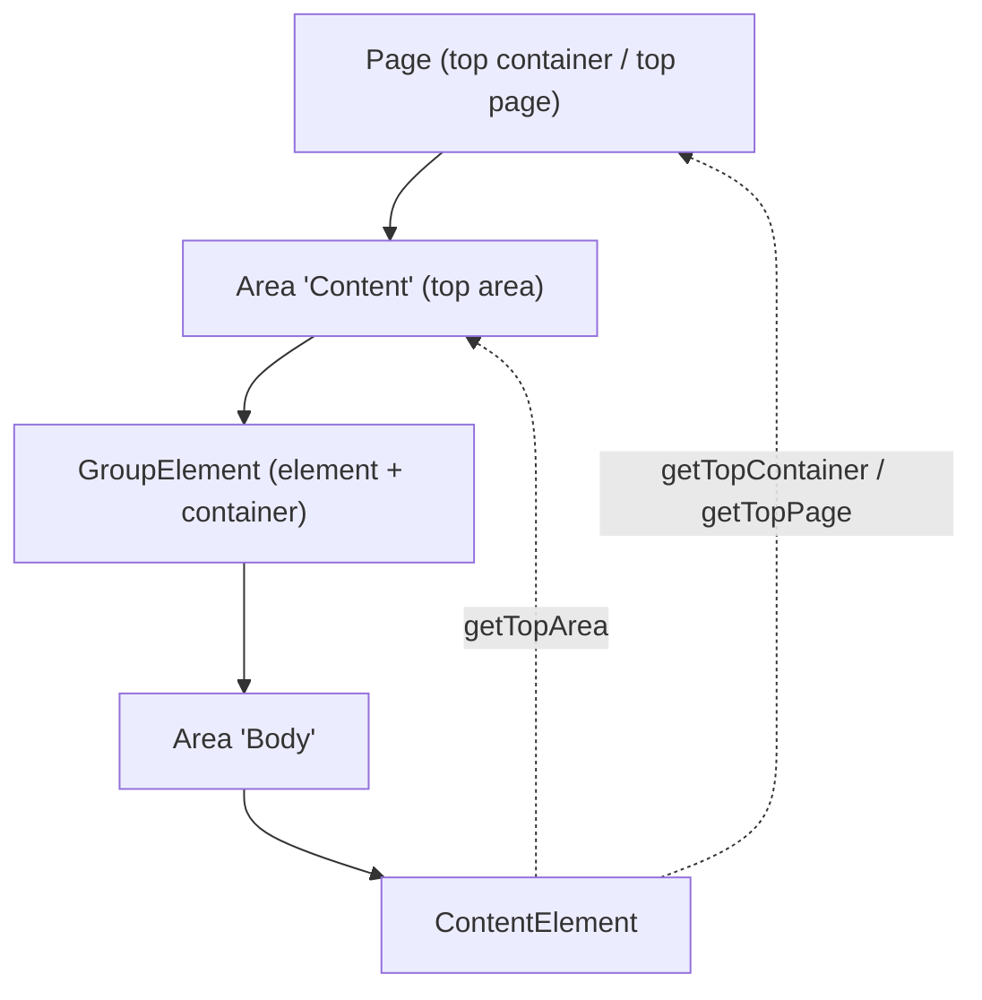

# Nesting & Hierarchy

An element can be a container. Apply `ElementalAreasContainer` to an element class and
declare areas on it, and you have nested elemental content — a "group", "list" or
"columns" block that holds other blocks. Because areas carry a polymorphic parent and
the same `Evo*` classes are used at every level, nesting works to any depth.

- [A nested-area element](#a-nested-area-element)
- [Traversing the hierarchy](#traversing-the-hierarchy)
- [Finding elements anywhere in the tree](#finding-elements-anywhere-in-the-tree)

## A nested-area element

```php
use App\Elemental\Areas\GroupArea;
use Fromholdio\Elemental\Base\Extensions\ElementalAreasContainer;
use Fromholdio\Elemental\Base\Model\EvoBaseElement;

class GroupElement extends EvoBaseElement
{
    private static $table_name = 'App_GroupElement';
    private static $singular_name = 'Group';
    private static $plural_name = 'Groups';
    private static $icon = 'font-icon-block-layout';

    private static $extensions = [
        ElementalAreasContainer::class,
    ];

    private static $elemental_areas = [
        'Body' => [
            'enabled' => true,
            'url_segment' => 'body',
            'has_one' => 'Body_Local',
            'cms_fields' => ['tab_path' => 'Root.Main'],
        ],
    ];

    private static $has_one = [
        'Body_Local' => GroupArea::class,
    ];

    private static $cascade_duplicates = ['Body_Local'];
}
```

`GroupElement` is now both an element (it lives in an area) and a container (it owns
the `Body` area). The nested area is configured and rendered exactly like a top-level
one, and it gets its own [routing segment](07_routing-and-controllers.md) under its
parent's.

Render the nested area in the group's element template:

```html
<%-- templates/App/Elemental/Elements/GroupElement.ss --%>
<div class="group">
    <% if $Title %><h2>$Title</h2><% end_if %>
    <% with $getElementalArea('Body') %>
        <% if $hasElements %>
            <div class="group__body">
                <% loop $getElementControllers %>$Me<% end_loop %>
            </div>
        <% end_if %>
    <% end_with %>
</div>
```

## Traversing the hierarchy

elemental-base provides cached helpers for walking *up* the tree from any element or
area. "Current" relationships are preferred over "local" ones, so traversal follows
the way content is actually being rendered (inherited/shared included).

From an **element**:

```php
$element->getArea();          // the area this element is in (current ?? local)
$element->getTopArea();       // the outermost area above this element
$element->getTopContainer();  // the outermost container in the hierarchy
$element->getTopPage();       // the outermost container, if it is a SiteTree
$element->getPage();          // alias of getTopPage()
```

From an **area**:

```php
$area->getContainer();        // this area's container (current ?? local)
$area->getTopArea();          // outermost area above this one (or itself)
$area->getTopContainer();     // outermost container
$area->getTopPage();          // outermost container, if a SiteTree
```

These are what make element links resolve correctly no matter how deeply nested a
block is: an element's front-end `Link()` is built from its **top container** plus its
anchor, so a block three groups deep still links to the right page and `#anchor`. See
[Routing & controllers](07_routing-and-controllers.md).



## Finding elements anywhere in the tree

Containers and areas can locate an element by ID across the whole nested structure,
including into provided/shared elements:

```php
$container->getElementByID($id);          // searches local areas, recursing into nesting
$container->getCurrentElementByID($id);    // same, following current (rendered) areas
$container->getElementByID($id, ['Content']); // restrict to named areas

$area->getElementByID($id);
$area->getCurrentElementByID($id);
```

`getElementByID()` looks through an area's own elements, into any
[provided elements](05_inheritance-and-sharing.md#element-providers-shared-elements),
and into any nested containers — so it resolves an element regardless of how it got
into the tree. This is the lookup the [router](07_routing-and-controllers.md) uses to
turn an area segment + element ID into a controller.

## Next

- [Routing & controllers](07_routing-and-controllers.md) — how nested elements are
  addressed and rendered.
