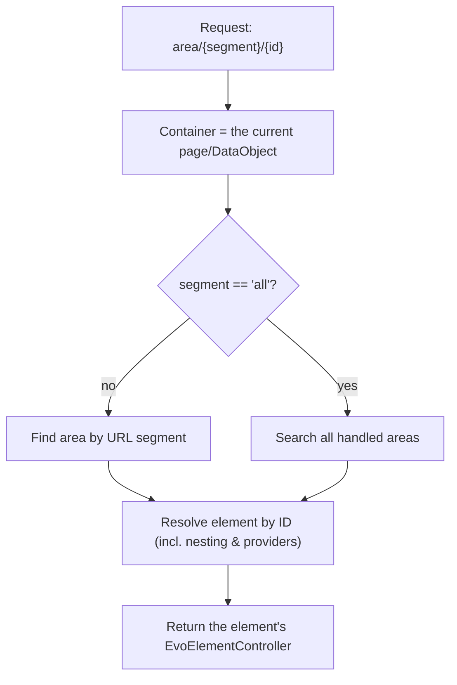

# Routing & Controllers

Vendor elemental routes every block beneath a single page-level handler (still the
case in 6.2). elemental-base replaces that with **area-scoped routing**: each element is addressable through the
area it belongs to, scoped to the areas present on the current request. The upshot is
that an element can act as its own request handler — handling form posts, AJAX
endpoints, or any action — at a stable, meaningful URL.

- [The route](#the-route)
- [EvoElementController](#evoelementcontroller)
- [Links](#links)
- [Restricting which areas route](#restricting-which-areas-route)
- [Elements that handle their own requests](#elements-that-handle-their-own-requests)

## The route

`ElementsRouter` is applied to `ContentController` (and to `EvoElementController`
itself, so nested elements route too). It registers:

```
area/$AreaURLSegment!/$ElementID!  →  handleElement
```

So an element is reached at, for example:

```
/some/page/area/content/42
```

`handleElement()` resolves the request like this:



- The **container** is the current request's page (or DataObject).
- The **area** is found by its `url_segment`; the special segment `all` searches every
  routable area instead.
- The **element** is resolved by ID using the recursive lookup from
  [Nesting & hierarchy](06_nesting-and-hierarchy.md), so nested and shared elements
  resolve too.
- The element's controller is returned to handle the rest of the request.

The old vendor `element/$ID` route is explicitly disabled (it returns 404), and
vendor's `ElementalContentControllerExtension` is neutralised — it is mapped through
`Injector` to a no-op extension (`fromholdio/silverstripe-empty-extension`), so it
loads but does nothing. Area-scoped routing replaces both.

## EvoElementController

Every element's controller is an `EvoElementController` (set via the element's
`controller_class` config, which defaults to it). It replaces the vendor
`ElementController` and adds:

- **`forTemplate()`** — renders the element through its
  [holder templates](08_templates-and-rendering.md), and, because element controllers
  render *inside* a page template, correctly emits any redirect set during `init()`
  rather than swallowing it.
- **`ElementForTemplate()`** — the element customised with controller-supplied data,
  for use inside a holder template.
- **`Link()` / `AbsoluteLink()` / `HandlerLink()`** — see below.
- The position helpers `First`, `Last`, `Pos`, `TotalItems`, `EvenOdd`.

To use a custom controller, point `controller_class` at a subclass:

```php
class MapElement extends EvoBaseElement
{
    private static $controller_class = MapElementController::class;
}

class MapElementController extends EvoElementController
{
    // custom actions, see below
}
```

When an element builds its controller, elemental-base sets the current request on it
*before* `init()` runs, so `$this->getRequest()` is available even when the element is
rendered in a template (not just when reached via a URL).

## Links

An element's links are built from its **top container** plus its anchor, so they
resolve correctly regardless of nesting, inheritance or sharing:

```php
$controller->Link();              // e.g. /some/page#e42-anchor
$controller->AbsoluteLink();      // absolute form
$controller->HandlerLink('save'); // a URL routed back to THIS element's controller
```

`HandlerLink($action)` is the important one for interactive elements: it produces a
URL on the element's page that routes through `area/{segment}/{id}` to the element's
controller and on to `$action`. The underlying segment is available as
`$element->getHandlerURLSegment()` / `$area->getHandlerURLSegment($action)`.

## Restricting which areas route

Not every area should accept routed requests — a decorative side area has no business
handling posts. Restrict routing with `handled_elemental_area_names` on the
controller that carries the router (typically your `PageController`):

```yaml
App\PageController:
  handled_elemental_area_names:
    - Content
    - Body
```

- Set to an **array** of area names to route only those areas.
- Set to **null** (the default) to route every area on the request.

Requests to an area outside the handled list return 404.

## Elements that handle their own requests

Because each element has a stable, routable URL, an element can respond to its own GET
or POST. Add `allowed_actions`/`url_handlers` to an `EvoElementController` subclass and
build the action URL with `$HandlerLink`:

```php
use SilverStripe\Control\HTTPRequest;
use Fromholdio\Elemental\Base\Controllers\EvoElementController;

class SignupElementController extends EvoElementController
{
    private static $allowed_actions = ['submit'];

    private static $url_handlers = [
        'submit' => 'submit',
    ];

    public function submit(HTTPRequest $request)
    {
        // $this->getElement() is the element instance.
        // Process the POST, then redirect or render.
        return $this->redirectBack();
    }
}
```

```html
<%-- the element's template --%>
<form action="$HandlerLink('submit')" method="post">
    <!-- fields -->
    <button type="submit">Sign up</button>
</form>
```

The form posts to `…/area/{segment}/{elementID}/submit`, the router resolves it back to
*this* element's controller, and `submit()` runs with the element in context. Several
such elements can coexist on one page, each handling its own requests independently.

> **Redirects:** because element controllers render within a page template, returning
> an `HTTPResponse` mid-render is not enough on its own. Set the redirect in `init()`
> (or an action) and `EvoElementController::forTemplate()` will emit it correctly.

## Migrating from vendor element routes

If you are moving a project from stock Elemental, replace any hand-built `element/$ID`
handler URLs with `$HandlerLink('action')` so the generated URL includes the area
segment. Generate handler URLs at render time rather than storing them.

## Next

- [Templates & rendering](08_templates-and-rendering.md) — holders, template stacks,
  and the full render chain.
