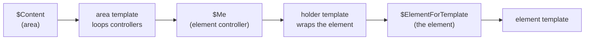

# Templates & Rendering

elemental-base does not ship front-end templates — you provide them. In return you get
a predictable render chain and a flexible template-naming scheme that lets an element
look different depending on the area (and *type* of area) it is rendered in, without
the element knowing anything about that area.

- [The render chain](#the-render-chain)
- [Templates you must provide](#templates-you-must-provide)
- [Area template stack](#area-template-stack)
- [Element and holder template stacks](#element-and-holder-template-stacks)
- [Holders](#holders)
- [Position helpers](#position-helpers)

## The render chain

Rendering an area runs through four hops:



1. A container renders an area — `$Content` (the relation) or
   `$getElementalArea('Content')` (current-aware) — which calls the area's
   `forTemplate()`.
2. The **area template** loops the area's element controllers and renders each with
   `$Me`.
3. `$Me` calls the **element controller**'s `forTemplate()`, which renders the
   element's **holder** template.
4. The **holder template** wraps the block and outputs `$ElementForTemplate`, which
   renders the **element template** itself.

## Templates you must provide

Because no templates ship with the module, the minimum to get content on screen is one
template at each level. The simplest base templates (matched by every area/element via
the stacks below) are:

```html
<%-- templates/Fromholdio/Elemental/Base/Model/EvoElementalArea.ss --%>
<% if $hasElements %>
    <% loop $getElementControllers %>$Me<% end_loop %>
<% end_if %>
```

```html
<%-- templates/Fromholdio/Elemental/Base/Model/EvoBaseElement_holder.ss --%>
<section id="$Anchor">
    $ElementForTemplate
</section>
```

```html
<%-- templates/App/Elemental/Elements/ContentElement.ss --%>
<% if $Title %><h2>$Title</h2><% end_if %>
$Content
```

With those in place, every area renders its blocks, every block is wrapped in a
`<section>` with its anchor, and each element class renders its own template. You then
add more specific templates only where you need them.

## Area template stack

An area is rendered with a stack derived from its class ancestry and its **name**,
down to and including `EvoElementalArea`. For a `SideArea extends ContentArea` named
`Aside`, the stack is (most specific first):

```
SideArea_Aside
SideArea
ContentArea_Aside
ContentArea
EvoElementalArea_Aside
EvoElementalArea
```

So you can theme a specific named area (`SideArea_Aside.ss`), a class of area
(`ContentArea.ss`), or fall back to the shared base (`EvoElementalArea.ss`).

## Element and holder template stacks

Element templates are the powerful part. The stack is built from the element's class
ancestry **and** the area it is being rendered in — both the area's *name* and its
[*types*](03_area-types-and-allowed-elements.md#area-types). For a `ContentElement`
rendered in an `Aside` area whose types are `['Side', 'Content']`, the element stack
includes (most specific first, per class, down to `BaseElement`):

```
ContentElement_Side_Aside
ContentElement_Content_Aside
ContentElement_Aside
ContentElement_Side
ContentElement_Content
ContentElement
… (then the same pattern for each ancestor class) …
EvoBaseElement
BaseElement
```

This means a single `ContentElement` can render one way in the main content area and
another in a sidebar, purely by adding `ContentElement_Side.ss`, with no PHP and no
conditional template logic.

The **holder** stack is identical but with a `_holder` suffix
(`ContentElement_Side_Aside_holder`, …, `EvoBaseElement_holder`), so holders can be
specialised the same way. If you set the `holder_templates` config on an element, that
overrides the stack entirely:

```php
private static $holder_templates = ['App/Elemental/Holders/PlainHolder'];
```

## Holders

A holder wraps each element with markup that is *about the block's place in the page*
rather than its content — the section element, the anchor target, header/footer
chrome, spacing hooks. Keeping that in the holder (rather than each element template)
means every block gets consistent wrapping and you write it once.

```html
<%-- EvoBaseElement_holder.ss --%>
<section id="$Anchor" class="block block--$getShortClassName(true) block--$EvenOdd">
    $ElementForTemplate
</section>
```

`$ElementForTemplate` is the element customised with any data the controller supplied
(via the `updateCustomDataForTemplate` hook on `EvoElementController`).

## Position helpers

As an area builds its visible list it stamps each element with its position, available
in both the holder and element templates and on the controller:

| Variable | Meaning |
| --- | --- |
| `$First` | true for the first visible element |
| `$Last` | true for the last visible element |
| `$Pos` | 1-based position |
| `$TotalItems` | count of visible elements |
| `$EvenOdd` | `'odd'` or `'even'` |

```html
<% if $First %><div class="section-lead"><% end_if %>
    $ElementForTemplate
<% if $Last %></div><% end_if %>
```

These are computed from the area's *filtered* list (only viewable, non-empty
elements), so positions reflect what is actually on the page.

## Next

- [Anchors & navigation](09_anchors-and-navigation.md) — `$Anchor` and building menus.
- [Routing & controllers](07_routing-and-controllers.md) — what `$Me` and
  `$ElementForTemplate` resolve to.
